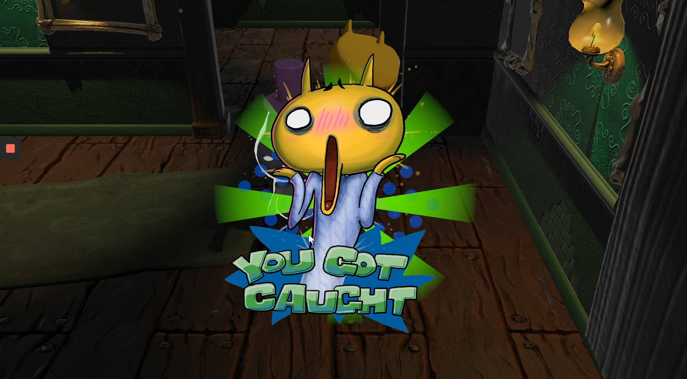

# 3D-Haunted-Jaunt
 
A 3D game created as part of [XRTerra's AR & VR Developer Program](https://xrterra.com/programs/developer/).

## Description

This application is a 3D game inspired by Unity Tutorials, but a modification of it. The playable character, John Lemon, who can be moved using arrow keys, is in a maze haunted with mobile ghosts and stationary gargoyles. The objective is to get John Lemon out of the maze without getting too close to ghosts or gargoyles. Upon getting too close to either of them, the game resets, and John Lemon is returned to his starting position.

## Installation

An executable file can be found in the Builds folder.

## Built With

* [Unity](https://unity.com/)
  * Version: 2019.4.5f1
* [Microsoft Visual Studio Code](https://code.visualstudio.com/)
  * Version: 2019
  
## Development Setup

The system requirements can be found [here](https://docs.unity3d.com/Manual/system-requirements.html).

## Contact
 
Daniel Sharvaaya Dash - daniel.s.dash@gmail.com
 
Project Link: https://github.com/drash7/3D-Haunted-Jaunt
 
## Contributing
 
I greatly appreciate any contribitions.
1. Fork the Project
2. Create your Feature Branch (`git checkout -b feature/CoolFeature`)
3. Commit your Changes (`git commit -m 'Add some CoolFeature'`)
4. Push to the Branch (`git push origin feature/CoolFeature`)
5. Open a Pull Request
